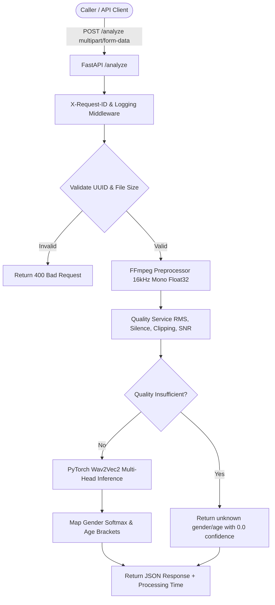

# Voice Gender/Age/Quality Analyzer

A production-ready Dockerized FastAPI microservice that ingests short caller audio, evaluates audio signal quality, and estimates speaker gender and age bracket using a pretrained Hugging Face model (`audeering/wav2vec2-large-robust-24-ft-age-gender`).

---

## 🌟 Key Features

- **Audio Signal Quality Classification**: Classifies uploaded audio into `good`, `degraded`, or `insufficient` using metrics (RMS, peak amplitude, silence ratio, clipping ratio, estimated SNR).
- **Joint Gender & Age Estimation**: Predicts gender (`male`, `female`, `unknown`) and age bracket (`18-30`, `31-45`, `46-60`, `60+`, `unknown`).
- **Single Model Multi-Task Architecture**: Uses a single pretrained Wav2Vec2 model with joint regression/classification heads for optimal memory efficiency.
- **Strict Privacy & Zero-Persistence**: Audio payloads are processed strictly in-memory and cleaned up immediately. Raw audio is never saved to disk or written to log files.
- **Dockerized & Self-Contained**: Multi-stage Docker setup with pre-baked model weights for instant container startup without runtime network dependencies.
- **Language Detection (Best-Effort)**: Adds `language: {"code": "en", "confidence": 0.95}` to every response via heuristic (opt-in Whisper tiny).
- **Real-time Streaming**: WebSocket endpoint `/ws/analyze` emits progressive `gender`, `age`, `quality`, `language` as audio chunks arrive.
- **Evaluation Harness**: `scripts/evaluate.py` computes accuracy + ECE calibration against labeled datasets (Common Voice etc.).
- **Fully Configurable**: All threshold parameters, max audio sizes, and timeouts are configurable via environment variables (`pydantic-settings`).

---

## 🏗️ System Architecture



---

## 📊 Model Information & License

- **Selected Model**: [`audeering/wav2vec2-large-robust-24-ft-age-gender`](https://huggingface.co/audeering/wav2vec2-large-robust-24-ft-age-gender)
- **License**: **CC-BY-NC-SA 4.0** (Non-Commercial). *Note: Suitable for evaluation/research. Commercial deployment would require fine-tuning an Apache-2.0 model.*
- **Gender Mapping**: Model 3-class output (`female`, `male`, `child`). `child` and low-confidence predictions map to `unknown`.
- **Age Mapping**: Continuous regression output ($0\text{--}1 \times 100 \rightarrow \text{years}$) mapped into discrete age brackets (`18-30`, `31-45`, `46-60`, `60+`).

---

## 🚀 Quick Start Guide

### Prerequisites
- Docker & Docker Compose **OR** Python 3.11+ and FFmpeg.

### Option A: Running with Docker Compose (Recommended)

1. **Build and start the service**:
   ```bash
   docker compose up --build
   ```

2. **Verify endpoints**:
   ```bash
   curl http://localhost:8000/health
   curl http://localhost:8000/ready
   ```

### Option B: Local Python Setup

1. **Create virtual environment & install dependencies**:
   ```bash
   python3 -m venv .venv
   source .venv/bin/activate
   pip install -r requirements.txt
   ```

2. **Run server**:
   ```bash
   uvicorn app.main:app --host 0.0.0.0 --port 8000
   ```

---

## 🧪 Testing & Verification

### Running Unit & Integration Tests
```bash
PYTHONPATH=. pytest tests/
```

### Running Lint Checks
```bash
ruff check .
```

### Automated Smoke Test
Run the automated smoke test against a running service:
```bash
python scripts/smoke_test.py http://localhost:8000
```

### Running Latency Benchmark
Measure latency against a 5-second audio payload (N=10 requests):
```bash
python scripts/benchmark.py http://localhost:8000 10
```

### Running Evaluation Harness (Bonus #3)
Evaluate accuracy + confidence calibration on a labeled dataset:
```bash
# Demo with heuristic labels from filename (sample_audio/labels.csv provided)
python scripts/evaluate.py --data-dir sample_audio --labels sample_audio/labels.csv

# Common Voice example (auto-detects validated.tsv / train.tsv)
python scripts/evaluate.py --data-dir /path/to/cv-corpus --limit 100

# Save detailed JSON report
python scripts/evaluate.py --data-dir sample_audio --output results.json
```

### WebSocket Streaming Demo (Bonus #1)
```bash
# Install extra client dep
pip install websockets

# Stream a file in ~500ms chunks
python scripts/streaming_client.py sample_audio/real_speech.wav --url ws://localhost:8000

# Manual with websocat / wscat:
websocat "ws://localhost:8000/ws/analyze?contact_id=123e4567-e89b-12d3-a456-426614174000"
# then send binary chunks + {"event":"end"}
```

---

## 📡 API Endpoints

### 1. `GET /health`
Liveness check.
- **Response `200 OK`**:
  ```json
  {
    "status": "ok"
  }
  ```

### 2. `GET /ready`
Readiness check verifying ML model initialization.
- **Response `200 OK`**:
  ```json
  {
    "status": "ready",
    "model_loaded": true
  }
  ```

### 3. `POST /analyze`
Analyzes uploaded audio file for caller quality, gender, and age.
- **Request**: `multipart/form-data`
  - `contact_id` (string, required): Valid UUID string.
  - `audio` (file, required): Audio file (WAV, MP3, OGG, FLAC, etc.).

- **Sample Request (`curl`)**:
  ```bash
  curl -X POST "http://localhost:8000/analyze" \
    -F "contact_id=123e4567-e89b-12d3-a456-426614174000" \
    -F "audio=@sample_audio/test_caller.wav"
  ```

- **Sample Response `200 OK`**:
  ```json
  {
    "contact_id": "123e4567-e89b-12d3-a456-426614174000",
    "gender": {
      "value": "female",
      "confidence": 0.892
    },
    "age": {
      "bracket": "31-45",
      "confidence": 0.814
    },
    "language": {
      "code": "en",
      "confidence": 0.92
    },
    "quality": {
      "classification": "good",
      "metrics": {
        "duration_seconds": 4.5,
        "rms": 0.0452,
        "peak_amplitude": 0.312,
        "silence_ratio": 0.12,
        "clipping_ratio": 0.0,
        "estimated_snr_db": 18.4
      }
    },
    "processing_time_ms": 1642.5
  }
  ```

- **Sample Error Response `400 Bad Request`**:
  ```json
  {
    "error": {
      "code": "INVALID_CONTACT_ID",
      "message": "Invalid contact_id '12345'. Must be a valid UUID string."
    }
  }
  ```

### 4. `WebSocket /ws/analyze` (Bonus #1 — Streaming)
Real-time streaming endpoint. Connect with a valid `contact_id`, then send binary audio chunks.

- **Connect**: `ws://localhost:8000/ws/analyze?contact_id=<uuid>` (or send `{"contact_id":"<uuid>"}` as first text frame)
- **Client → Server**:
  - Binary frame: raw audio bytes (any FFmpeg-decodable format fragment)
  - Text frame: `{"event":"chunk","audio_base64":"<b64>"}` (alternative)
  - Text frame: `{"event":"end"}` to finalize
- **Server → Client** (JSON frames):
  ```json
  {"event": "stream_started", "contact_id": "..."}
  {"event": "prediction_update", "accumulated_duration_seconds": 1.2, "gender": {"value":"female","confidence":0.91}, "age": {"bracket":"18-30","confidence":0.84}, "language": {"code":"en","confidence":0.75}, "quality_classification": "good"}
  {"event": "stream_completed", "accumulated_duration_seconds": 4.5, "gender": {...}, "age": {...}, "language": {...}, "quality_classification": "good"}
  {"event": "error", "message": "...", "code": "INVALID_AUDIO"}
  ```
- **Example client**: `python scripts/streaming_client.py sample_audio/real_speech.wav`

---

## ⚡ Latency & Benchmarks

Empirical performance measured on Intel Core i5-9300H CPU @ 2.40GHz (8 vCPUs) for a **5.0s audio payload**:

| Metric | Server Latency | Total Client RTT |
|---|---|---|
| **Average** | 1709 ms | 1712 ms |
| **P50 (Median)** | 1668 ms | 1672 ms |
| **P95** | 1871 ms | 1875 ms |

---

## ⚙️ Configuration Reference

All settings can be customized via `.env` or environment variables:

| Variable | Default | Description |
|---|---|---|
| `HOST` | `0.0.0.0` | Host IP binding |
| `PORT` | `8000` | Port binding |
| `MODEL_NAME` | `audeering/wav2vec2-large-robust-24-ft-age-gender` | Hugging Face model repository |
| `MAX_AUDIO_SIZE_MB` | `10.0` | Max allowed audio file size in MB |
| `MIN_AUDIO_DURATION_SECONDS` | `0.5` | Min audio duration for analysis |
| `MAX_AUDIO_DURATION_SECONDS` | `30.0` | Max audio duration for analysis |
| `GENDER_CONFIDENCE_THRESHOLD` | `0.5` | Threshold below which gender is `unknown` |
| `AGE_CONFIDENCE_THRESHOLD` | `0.5` | Threshold below which age is `unknown` |
| `MIN_RMS` | `0.01` | Minimum RMS threshold for valid audio |
| `MAX_CLIPPING_RATIO` | `0.05` | Max allowed clipping ratio before `degraded` |
| `MAX_SILENCE_RATIO` | `0.70` | Max allowed silence ratio before `insufficient` |
| `MIN_ESTIMATED_SNR` | `5.0` | Minimum SNR in dB before `degraded` |
| `LANGUAGE_DETECTION_ENABLED` | `true` | Enable best-effort language field |
| `LANGUAGE_USE_WHISPER` | `false` | Opt-in heavy Whisper tiny language detection (adds ~2s latency) |
| `LANGUAGE_FALLBACK_CODE` | `en` | Fallback ISO code for heuristic path |
| `WS_CHUNK_GROWTH_BYTES` | `8000` | Min new bytes before re-running streaming inference |
| `WS_MAX_ACCUMULATED_MB` | `10.0` | Max accumulated buffer for streaming (guard) |
